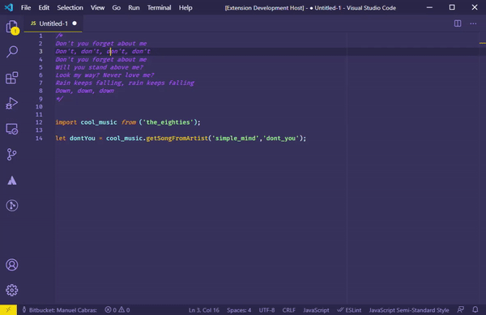

# simple-comment-toggle README

Simple extension written in a boring evening night thanks to [Wes Bos' Tweet](https://twitter.com/wesbos/status/1352306763425587202). 
It basically untoggles a multiline js comment without needing to select the code block first. 

Code is nasty, I'm already sorry. It's my first extension and was more a "let's learn some stuff" rather than a "let's have a decent solution" but it works almost well. 

Might not work correctly if the same comment is somewhere else in the same page. Sorry. 
